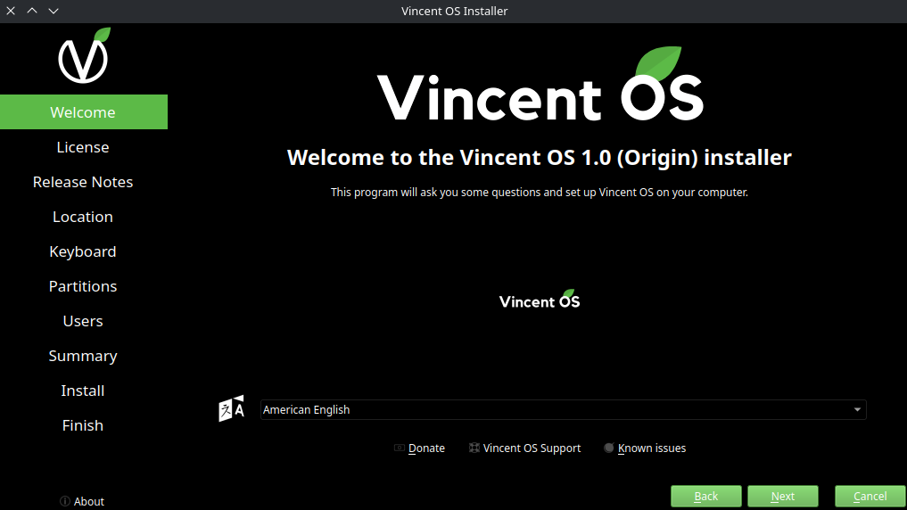
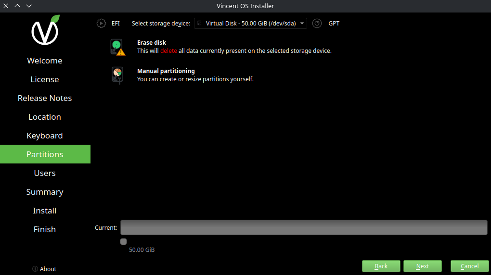
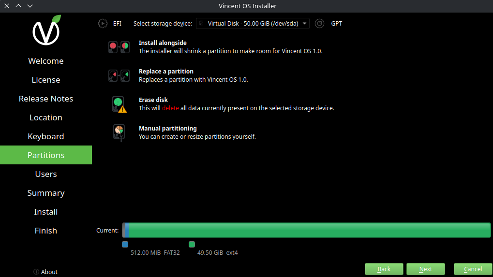

# Installation Steps
You are now ready to begin the installation process. Follow the steps below to install Vincent OS on your system:

## Step 1: Start the Installer
From the desktop environment, go to the start menu and go to the following location:\
``System -> Install System``

## Step 2: Follow the Installer Instructions

### Welcome Screen
This is the welcome screen for the Vincent OS Installer, it will check if your system meets the minimum requirements for the installation.

You can select your language from the dropdown menu and click "Next" to proceed.

### License & Release Notes
Before proceeding with the installation, you must accept the following licenses
- [Vincent OS European Union Public License (EUPL) 1.2](https://joinup.ec.europa.eu/sites/default/files/custom-page/attachment/2020-03/EUPL-1.2%20EN.txt)
- [Vincent OS GNU General Public License (GPL) 3](https://www.gnu.org/licenses/gpl-3.0.html#license-text)
- [v38armageddon Privacy Policy](https://www.v38armageddon.net/Privacy)

----
After accepting the licenses, you can find the latest Release Notes on the installer, it indicates all the new features and improvements in the new version of Vincent OS.

### Location & Keyboard
In this step, you will configure your location and keyboard settings.

### Partitions
You will need to choose where Vincent OS will be installed, you may encounter two views depending on your configuration:
1. New Installation without any existing partitions or installed Operating Systems\

2. Existing Installation or other operating systems\


Here is a explanation of the different options:
- [Existing installation only] **Install alongside**: This option will install Vincent OS alongside with an existing operating system, allowing you to choose which OS to boot at startup.

```admonish warning
Be sure to have enough disk space available to have the comfort of using both operating systems without having space issues.
```

- [Existing installation only] **Replace a partition**: This option will replace an existing partition with Vincent OS, erasing all data on the selected partition. This option is useful when you want to quickly reinstall Vincent OS without having to erase all data on the disk.

- **Erase disk**: This option will erase the entire disk and install Vincent OS. This is the recommended option for a full clean installation.

- **Manual partitioning**: This option is for advanced users who want to create, delete, or modify partitions manually. This gives you full control over the partitioning scheme but requires a good understanding of disk partitioning.

### Users
In this step, you will create your user account. You will need to provide the following information:
- Username (must be in lowercase, not containing spaces)
- Full name
- Computer name (generated in the following format: ``<username>-<your pc motherboard>-vincentOS``)
- Password

### Summary & Install
This will recapitulate all the choices you made during the installation process. Review the summary carefully and click "Install" to begin the installation of Vincent OS. A message will appear to confirm a last time your installation.

The installation process will begin, and you will see a progress bar indicating the status of the installation. This may take some time.

### Finish
Once the installation is complete, you will see a message indicating that Vincent OS has been successfully installed. You can then reboot your system and start using Vincent OS!

```admonish note
You can follow the [post-installation tips](post-installation.md) to help you get started with Vincent OS.
```